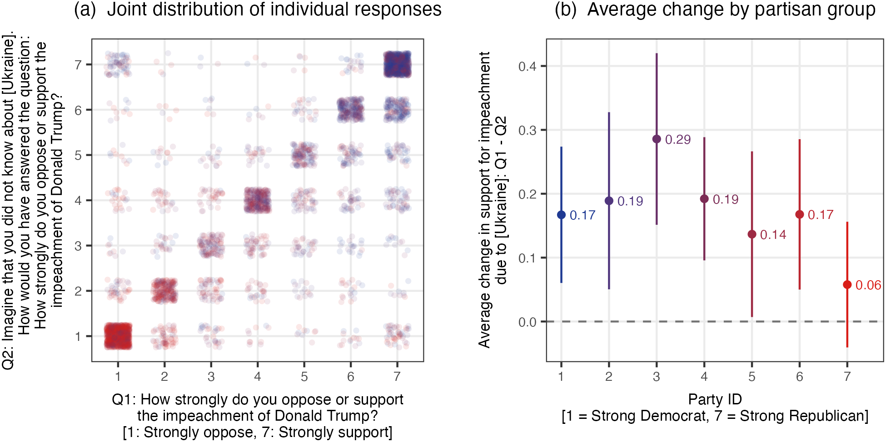
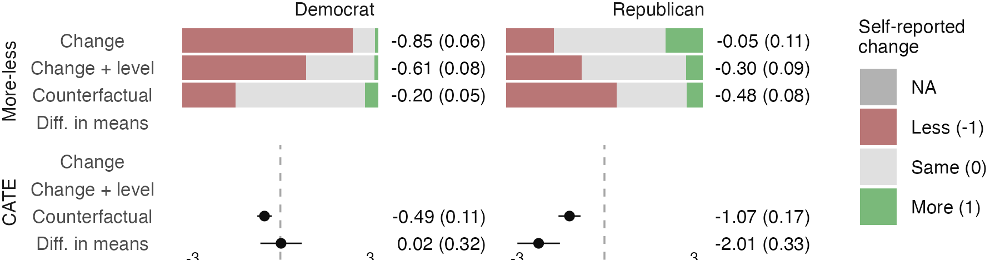
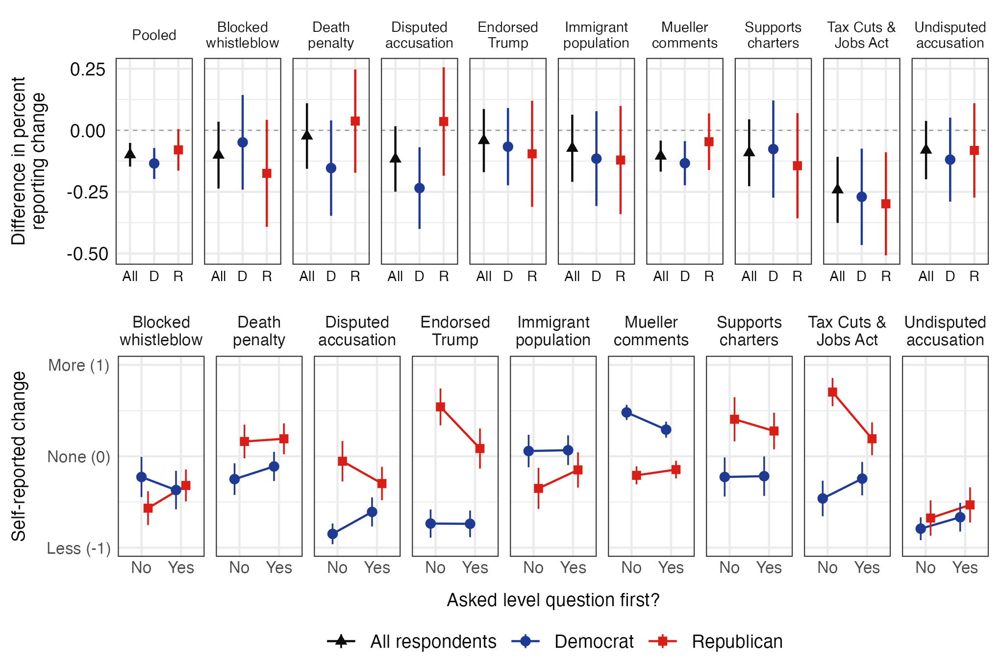
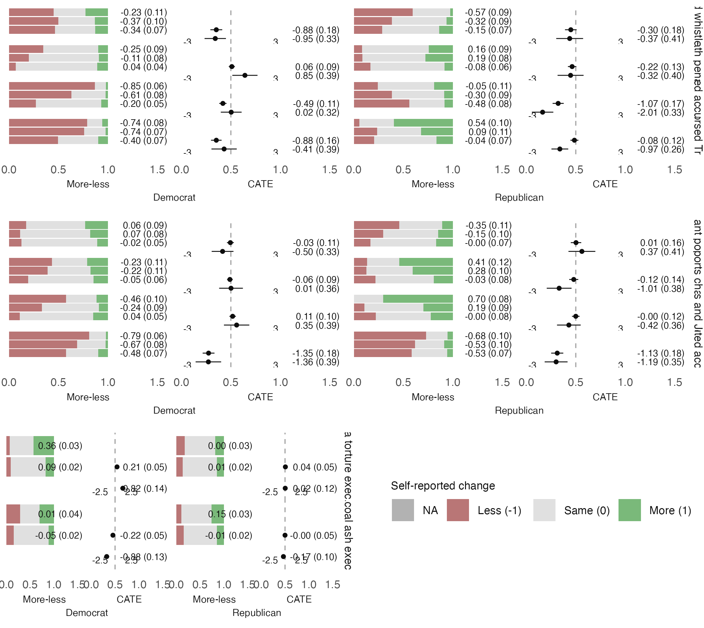
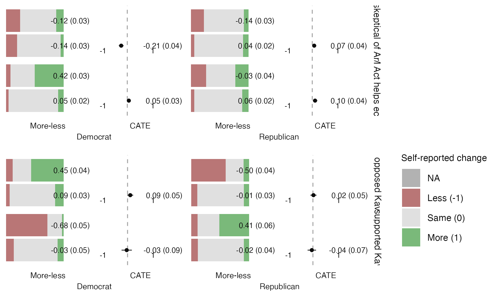
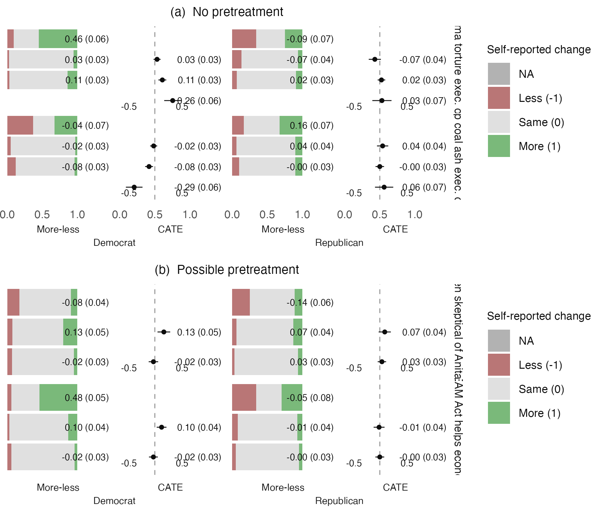

# Reproducibility Report: Graham and Coppock (2021)


- [Paper Overview](#paper-overview)
- [Summary](#summary)
  - [Does the deposited archive run?](#does-the-deposited-archive-run)
  - [Does the maintained rewrite reproduce the
    paper?](#does-the-maintained-rewrite-reproduce-the-paper)
- [Original Archive Reproducibility](#original-archive-reproducibility)
- [Ground Truth](#ground-truth)
- [Maintained Rewrite](#maintained-rewrite)
- [Figures](#figures)
- [Rewrite Verification](#rewrite-verification)
- [R Environment](#r-environment)

*Drafted by Claude Opus 5 under the supervision of Alex Coppock.*

This repository holds the actively maintained replication code for
Graham and Coppock (2021), together with the reproducibility report that
documents what the original archive did and did not do. It is part of a
program applying the maintenance proposal in Peer, Orr and Coppock
(2021, *PS: Political Science & Politics*, doi
[10.1017/S1049096521000366](https://doi.org/10.1017/S1049096521000366))
to a set of published archives.

|  |  |
|----|----|
| Article | [10.1093/poq/nfab009](https://doi.org/10.1093/poq/nfab009) |
| Replication archive | [10.7910/DVN/GFF78K](https://doi.org/10.7910/DVN/GFF78K) |
| Mirror deposit | [10.60600/YU/2ADPVK](https://doi.org/10.60600/YU/2ADPVK) |
| Pre-analysis plans | none |

**The data are not redistributed here.** The deposit lives at Harvard
Dataverse and that is the only copy this repository points at.
`download_original.R` fetches it and verifies every file;
`original_manifest.csv` records the Dataverse file identifiers, the UNF
of each ingested data file, and two checksums per file: the MD5 of the
bytes Dataverse serves, which is what this code was written against, and
the MD5 Dataverse publishes. Here the two agree for all 12 files. They
do not always, so the script verifies against the served bytes and
reports any disagreement. It also checks byte sizes and stops if
`original/` holds anything the manifest does not list, because an
archive script that writes into its own directory adds files as well as
overwriting them. Either way the exact bytes are pinned in version
control even though the bytes themselves are not. Re-hosting a copy
would create a second archive that can drift from the first, which is
the problem this project exists to document rather than to add to.

**Repository layout.** `maintained/` is the maintained rewrite: one
script per published table or figure, writing to `output/`, which is
committed so a reader can compare a fresh run against it without
downloading anything. `ground_truth/` ties every published number to the
code that produces it. `original/` is created by the download script and
is deliberately absent from the repository. This README is the
reproducibility report, also available as a PDF in `report/`.

**License.** CC0 1.0 Universal, matching the terms of the deposit this
repository maintains, so nothing in the chain is more restrictive than
the archive itself. See `LICENSE`.

**To reproduce.** Clone or download the repository, open
`graham_coppock_2021.Rproj`, and run:

``` r
source("run_all.R")
```

That fetches the deposited archive from Dataverse, verifies its 12
checksums, produces every published figure, appendix table and in-text
number into `maintained/output/`, rebuilds the ground truth from those
outputs, and re-checks the deposit. It takes about 75 seconds, of which
roughly 65 are the 10,000-resample bootstrap behind Table D.5.
Individual scripts run on their own in any order, subject to the
dependencies in each script’s header: `clean_studies.R` first, then the
two estimation scripts, then the figures, tables and in-text scripts
that read them.

Required packages: tidyverse, estimatr, ggh4x, gridExtra, rsample,
knitr, kableExtra, here. Paths resolve through `here`, so nothing
depends on the working directory and the scripts work equally well under
`Rscript` outside RStudio. A successful run overwrites
`maintained/output/`, which is committed: **`git diff` on that folder is
the reproduction check**, and the CSV and PNG output should come back
byte-identical. The six PDF figures always show as changed, because a
PDF records the time it was written; compare their PNG twins instead.

## Paper Overview

**Citation**: Graham, M. H. and Coppock, A. (2021). Asking about
attitude change. *Public Opinion Quarterly*, 85(1), 28–53.

**Research question**: When a survey asks people whether some event or
piece of information made them more or less supportive of something, do
their answers measure attitude change? The paper’s claim is that they
largely do not: respondents use the change question to express the
*level* of their attitude, a bias the paper calls response substitution.

**Design**: Four survey experiments plus one illustrative survey. The
illustration is a 4,034-respondent Lucid survey on impeaching Donald
Trump, asked in the paper’s proposed *counterfactual format*:
respondents report their attitude, then report what they would have said
had they not known about the Ukraine affair. Studies 1 (N = 417), 2a (N
= 2,475) and 2b (N = 1,110) randomly assign respondents both to an
information treatment and to a question format, so the self-reported
change can be set against an experimental difference in means on the
same treatment. Study 3 (N = 1,074) varies only the format. Estimation
is by difference in means and by group means with HC2 standard errors,
clustered by respondent where a respondent answers about more than one
treatment.

**Main finding**: The change format performs badly and the
counterfactual format performs well. Across ten treatments split by
party, the more-minus-less statistic derived from the change format has
the opposite sign to the experimental benchmark in 12 of 20 comparisons,
against 3 of 20 for the counterfactual format. Asking a level question
first cuts reports of any change by about 10 percentage points, which is
what response substitution predicts.

------------------------------------------------------------------------

## Summary

Two questions, answered before the detail.

### Does the deposited archive run?

Not as deposited. `analysis_impeach.R`, which draws Figure 1, runs to
completion. `analysis_main.R`, which produces everything else, fails
twice.

- It fails first at
  `ggsave("drafts/POQ_RR/figures/substitution_new.png", ...)`, one of
  six active `ggsave()` calls writing into two directory trees on the
  authors’ own machine that the deposit does not contain. Every analysis
  in the script completes; only the writes fail.
- With those directories created it fails again, and this one is
  substantive: `object 'check_labeller' not found`. The archive ships
  its own `facet_nested()` in `functions.R`, copied from an early
  standalone script, and that function calls
  `ggplot2:::check_labeller()` and `ggplot2:::var_list()`. Both are
  unexported internals and both have since been removed from ggplot2.
  The function is used for every panel of Figures 2, 4, 5 and E.2, so
  the failure takes out four of the paper’s six figures.

Neither failure needed the authors’ help or a file the archive omits.
Substituting `ggh4x::facet_nested()`, the maintained successor to the
same code, is enough to make the whole script run.

Two smaller things are worth recording because a reader reproducing this
work will meet them. `analysis_impeach.R` writes
`GrahamCoppock19-0280-Figure1.jpeg` to a bare relative path, and both
scripts leave an `Rplots.pdf` behind when run non-interactively, so
running the archive in its own directory silently adds two files to the
deposit. And `functions.R` calls `plyr` in eight places without any
script declaring it, while `analysis_main.R` loads `ggpubr`, `janitor`
and `ggrepel` and never calls a function from any of them.

### Does the maintained rewrite reproduce the paper?

Almost entirely. Every appendix table reproduces cell for cell, and 50
of the 57 recorded claims match.

| Component | Verdict |
|:---|:---|
| Figure 1b (seven printed group means) | All seven reproduce |
| Figure 2 (ten printed labels) | All ten reproduce |
| Figure 3 (shape and the effects the text quotes) | Reproduces |
| Figure 4 (96 printed labels) | 95 of 96 reproduce; the miss is a rounding tie |
| Figure 5 (24 printed labels) | All 24 reproduce |
| Figure E.2 (44 printed labels) | All 44 reproduce |
| Table D.3 (336 cells) | All reproduce, with the published column headings transposed |
| Table D.4 (216 cells, 72 p-values) | All reproduce |
| Table D.5 (60 point estimates) | All reproduce |
| Table D.5 (bootstrap intervals) | 53 of 60 rows; the deposited script reproduces all 60 |
| In-text numbers | All but two reproduce; both are the article rounding its own estimate |

Reproduction verdict by component

The exceptions are small and none of them is a failure of the analysis.

**The article rounds two of its own numbers away from what its data
give.** The text reports the two impeachment questions correlating at
0.82; the deposited data give 0.828, which prints as 0.83. It reports
the level question reducing Democrats’ reports of change by 14 points;
the estimate is 13.5 points, which prints as 13. Both are one unit in
the last printed digit, and neither touches a conclusion.

**Study 3’s published N cannot be recovered from the deposit.** The
article reports 1,074 respondents. The deposited data hold 1,023
distinct Study 3 respondents, in the standalone `data_study3.csv` and in
the merged file alike. The published figure is the full Mechanical Turk
survey and the deposit carries only the respondents in a question format
condition; Table D.3’s Study 3 rows reproduce exactly from what is
there.

**Table D.3’s column headings are transposed relative to its own body.**
The published table heads its second and third value columns “No change”
and “Less”, but in all 84 rows the printed Difference equals More minus
the column headed “No change”. Read in that corrected order all 336
cells reproduce. Read as printed, 172 do. The numbers in the table are
right; the two headings are swapped.

**One printed label in Figure 4 differs, and it is a rounding tie.** For
the Undisputed accusation treatment among Republicans, the
counterfactual-format estimate is a mean that comes to exactly -1.125.
`lm_robust` returns it one unit in the last place away from that tie, so
it prints as -1.13, which is what both the deposited script and this
rewrite produce. The published figure prints -1.12, which is what the
tie itself gives, and which is also what the appendix’s Table D.5 prints
for the same quantity. Nothing about the estimate differs; only the last
printed digit does.

**Table D.5’s bootstrap intervals are the one place the rewrite and the
deposit part company.** Both draw 10,000 resamples from seed 0. The
deposited script resamples every cell in the counterfactual data and
then keeps the twenty the table reports; the rewrite selects the twenty
first, so the two walk different random streams from the same seed. The
deposited script reproduces all sixty published rows exactly. The
rewrite differs on seven rows by a unit in the second decimal, which is
Monte Carlo variation rather than a difference in the estimator, and no
interval changes whether it covers zero.

------------------------------------------------------------------------

## Original Archive Reproducibility

**Archive source**: Harvard Dataverse, DOI 10.7910/DVN/GFF78K, 12 files.

The archive contains two analysis scripts, a shared `functions.R`, a
codebook, a readme, and seven data files: the merged Studies 1 to 3
frame and the impeachment survey as `.rds`, and both plus the four
individual studies as `.csv`.

| Script | Status | Issue |
|:---|:---|:---|
| functions.R | Sourced by both | Custom facet_nested() calls two ggplot2 internals that no longer exist; undeclared dependency on plyr |
| analysis_impeach.R | Runs | Writes a JPEG to a bare relative path, and an Rplots.pdf under Rscript |
| analysis_main.R | FAILS | Six ggsave() calls to directories the deposit does not contain, then facet_nested() |

Original archive reproducibility check (current R environment)

**Failure details.**

- `analysis_main.R` lines 192, 193, 531, 545, 551 and 566 call
  `ggsave()` into `drafts/POQ_RR/figures/` and
  `drafts/POQ_final/final figures/`. Neither directory is in the
  deposit. The script’s own comments elsewhere say to change the paths
  and uncomment the calls, and most of the `ggsave()` calls are indeed
  commented out; these six are not.

- `functions.R` defines a 250-line `facet_nested()` that predates the
  version now in `ggh4x`. It calls `ggplot2:::check_labeller()` at line
  159 and `ggplot2:::var_list()` at line 335. Both were unexported and
  both are gone from current ggplot2, and either is fatal.
  `ggh4x::facet_nested()` is the maintained successor and is a drop-in
  replacement here.

- `functions.R` also defines a `position_jitter_ellipse()` ggproto that
  calls `ggplot2:::with_seed_null()`. That internal still exists, so
  Figure 1 draws today. It is an unexported function nonetheless, and
  the rewrite uses the standard `position_jitter()` instead; the panel
  carries no numbers and the article describes the jitter only as “a
  small amount random noise added to distinguish the points.”

**Deprecations that warn rather than fail**: `%>%`, `do(tidy(...))`,
`gather()` and `spread()`, `geom_errorbar()` for confidence bars,
`size =` for line widths, `ifelse()`, `rm(list = ls())` at the top of
both scripts, and `source("functions.R")` by relative path.

**One coding slip, carried forward rather than corrected.** Assembling
the estimates for Figures 2, 4, 5 and E.2, the deposited script sorts
the topics with `factor(Study, c(1, 4, 2, 3))`. The study labels are
`1`, `2a`, `2b` and `3`, so `2a` and `2b` do not match any level and
become `NA`, sorting last. That ordering is what produced the published
facet sequence, so the rewrite keeps it; it uses the sort key and then
drops it, rather than carrying a study column that is empty for half the
rows.

------------------------------------------------------------------------

## Ground Truth

`ground_truth/build_ground_truth.R` writes
`graham_coppock_2021_ground_truth.csv` and runs as the last step of
`run_all.R`, so the table cannot drift from the pipeline. Published
values are read from the article and the supplementary materials and
live either in that script or in the four `published_*.csv` files beside
it, which transcribe Tables D.3, D.4 and D.5 and the printed labels of
Figures 2, 4, 5 and E.2 in the layout the pages print them in. Every
value in the `value_rewrite` column is read back out of
`maintained/output/`; none is typed. The verdicts are computed, by
printing the rewrite’s number to the precision the page prints and
comparing digits.

`ground_truth/extract_archive_values.R` fills the `value_script` column.
It runs the deposited scripts in a scratch copy, with the two repairs
above, and compares each of their objects against the maintained output
it corresponds to.

| Object | Archive rows | Rewrite rows | Joined | Largest difference |
|:---|---:|---:|---:|---:|
| grand comparison estimates | 480 | 480 | 480 | 0.0000 |
| pretreated estimates | 428 | 428 | 428 | 0.0000 |
| Figure 1b group means | 7 | 7 | 7 | 0.0000 |
| Figure 3a estimates | 30 | 40 | 30 | 0.0000 |
| Table D.3 cells | 336 | 336 | 336 | 0.0000 |
| Table D.4 cells | 216 | 216 | 216 | 0.0000 |
| Table D.5 point estimates | 60 | 60 | 60 | 0.0000 |
| Table D.5 bootstrap quantities | 60 | 60 | 60 | 0.0109 |

Deposited scripts against the maintained rewrite, object by object

Everything except the Table D.5 bootstrap agrees to machine precision.
The Figure 3a row joins 30 of the rewrite’s 40 estimates because the
rewrite also estimates the pure independents that the panel leaves out
and the surrounding text quotes.

| Where the difference lies | Rows |
|:--------------------------|-----:|
| matches                   |   50 |
| paper_internal            |    3 |
| environment               |    2 |
| archive                   |    1 |
| rewrite                   |    1 |

Ground truth: 50 of 57 claims match

| Claim | Published | Rewrite | Locus |
|:---|---:|---:|:---|
| Text, p. 32: Correlation of the two impeachment questions | 0.82 | 0.8285 | paper_internal |
| Text, p. 44: Study 3 N | 1074.00 | 1023.0000 | archive |
| Text, p. 44: Same decrease among Democrats (points) | 14.00 | 13.4590 | paper_internal |
| Figure 4: Printed labels agreeing with the published figure | 96.00 | 95.0000 | environment |
| Figure 4: Undisputed accusation, Republican, CATE, Counterfactual | -1.12 | -1.1250 | environment |
| Table D.3: Cells agreeing if the column headings are read as printed | 336.00 | 172.0000 | paper_internal |
| Table D.5: Bootstrap standard errors and interval endpoints agreeing | 60.00 | 53.0000 | rewrite |

The 7 claims that do not match

The full table, all 57 rows with their notes, is
`ground_truth/graham_coppock_2021_ground_truth.csv`.

------------------------------------------------------------------------

## Maintained Rewrite

| Script | Output |
|:---|:---|
| helpers.R | Packages, colours, theme, the shared grand comparison panel |
| clean_studies.R | output/data_study1-3_clean.rds, output/data_impeach_clean.rds |
| estimates_grand_comparison.R | output/estimates_grand_comparison.{rds,csv} |
| estimates_pretreated.R | output/estimates_pretreated.{rds,csv} |
| figure_1_impeach_counterfactual.R | output/figure_1_impeach_counterfactual.{pdf,png,csv} |
| figure_2_cornish_example.R | output/figure_2_cornish_example.{pdf,png,csv} |
| figure_3_response_substitution.R | output/figure_3_response_substitution.{pdf,png}, three CSVs |
| figure_4_grand_comparison.R | output/figure_4_grand_comparison.{pdf,png,csv} |
| figure_5_pretreat_comparison.R | output/figure_5_pretreat_comparison.{pdf,png,csv} |
| figure_e2_study2b_simultaneous.R | output/figure_e2_study2b_simultaneous.{pdf,png,csv} |
| table_d3_change_distribution.R | output/table_d3_change_distribution{,\_estimates}.csv |
| table_d4_counterfactual_accuracy.R | output/table_d4_counterfactual_accuracy{,\_estimates}.csv |
| table_d5_ate_vs_self.R | output/table_d5_ate_vs_self{,\_estimates}.csv |
| text_intext_stats.R | output/text_intext_stats.csv |
| text_sign_comparison.R | output/text_sign_comparison.csv |

Maintained rewrite scripts

Two structural choices are worth naming. Figures 2, 4, 5 and E.2 are the
same panel drawn over different subsets, which is how the deposit built
them too, so the panel is one function in `helpers.R` and every figure
script calls it. And the estimates behind those four figures are
computed once, in `estimates_grand_comparison.R` and
`estimates_pretreated.R`, so no estimate in the paper is computed twice
by two scripts that could then disagree.

Every figure script writes a CSV of what it plots, and every table
script writes its cells twice: once formatted as the appendix lays them
out, once unrounded. The unrounded copy is what the ground truth reads,
so a comparison against a published two-decimal table never has to parse
a three-decimal string and round it a second time.

| Original | Rewrite |
|:---|:---|
| custom facet_nested() using ggplot2 internals | ggh4x::facet_nested() |
| coord_flip() with Format on the discrete axis | native horizontal layout: y = Format, x = estimate |
| position_jitter_ellipse() ggproto | position_jitter() with a seed |
| %\>% | \|\> |
| do(tidy(…)) | reframe(tidy(…)) |
| gather() / spread() | pivot_longer() / pivot_wider() |
| geom_errorbar(width = 0) | geom_linerange() |
| ifelse() | if_else() |
| recode() | recode_values() |
| replicate(10000, oneDifference(.)) | rsample::bootstraps(times = 10000) |
| xtable + print.xtable to the console | write_csv() to output/ |
| size = for line widths | linewidth = |
| rm(list = ls()) | removed |
| ggsave() to the authors’ own directories | ggsave() through here::here() into maintained/output/ |
| library() in each script | source(helpers.R); all packages in helpers.R |

Deprecated patterns and replacements

**The layout change is the largest one.** The deposit draws the grand
comparison panel with `coord_flip()` over
`facet_nested(Party + Estimator ~ Topic, switch = "y")`. Combined with
`space = "free_y"`, that arrangement errors out under `ggh4x`. The
rewrite maps the panel natively instead, with `Format` on the vertical
axis and the estimate on the horizontal, and facets on
`Topic ~ Party + Estimator` with `switch = "x"`. Nothing about the
estimates changes and the figures carry the same content in the same
arrangement.

**The bootstrap is the same estimator by a different engine.** The
deposit resamples rows by hand inside `replicate()`; the rewrite uses
`rsample::bootstraps()` at the same seed and the same 10,000 draws. Both
are the nonparametric bootstrap over the same rows, and the point
estimates are identical. The intervals differ on seven of sixty rows in
the second decimal, for the reason given in the Summary.

------------------------------------------------------------------------

## Figures













------------------------------------------------------------------------

## Rewrite Verification

| Table or figure | Claim | Published | Rewrite | Match | Locus |
|:---|:---|---:|---:|---:|:---|
| Text, p. 31 | Survey responses obtained from Lucid | 4034.00 | 4034.0000 | 1 | NA |
| Text, p. 32 | Correlation of the two impeachment questions | 0.82 | 0.8285 | 0 | paper_internal |
| Text, p. 32 | Share reporting exactly zero change | 0.72 | 0.7209 | 1 | NA |
| Text, p. 32 | Average difference between the two questions | 0.16 | 0.1601 | 1 | NA |
| Text, p. 32 | Standard error of that average | 0.02 | 0.0226 | 1 | NA |
| Text, p. 38 | Cornish, Democrats reporting less likely (per cent) | 87.00 | 86.7920 | 1 | NA |
| Text, p. 38 | Cornish, Republicans reporting no effect (per cent) | 57.00 | 56.7570 | 1 | NA |
| Text, p. 39 | Cornish, effect of the level question on Democrats’ more-minus-less score | 0.24 | 0.2404 | 1 | NA |
| Text, p. 39 | Standard error of that effect | 0.10 | 0.0972 | 1 | NA |
| Text, p. 39 | Cornish, same effect among Republicans | -0.24 | -0.2438 | 1 | NA |
| Text, p. 39 | Standard error of that effect | 0.14 | 0.1421 | 1 | NA |
| Text, p. 40 | Study 1 N | 417.00 | 417.0000 | 1 | NA |
| Text, p. 40 | Study 2a N | 2475.00 | 2475.0000 | 1 | NA |
| Text, p. 44 | Study 2b N | 1110.00 | 1110.0000 | 1 | NA |
| Text, p. 44 | Study 3 N | 1074.00 | 1023.0000 | 0 | archive |
| Text, p. 44 | Decrease in reporting any change, all respondents (points) | 10.00 | 9.9271 | 1 | NA |
| Text, p. 44 | Standard error of that effect (points) | 2.00 | 2.4431 | 1 | NA |
| Text, p. 44 | Same decrease among Democrats (points) | 14.00 | 13.4590 | 0 | paper_internal |
| Text, p. 44 | Standard error, Democrats (points) | 3.00 | 3.1890 | 1 | NA |
| Text, p. 44 | Same decrease among Republicans (points) | 8.00 | 7.9455 | 1 | NA |
| Text, p. 44 | Standard error, Republicans (points) | 4.00 | 4.2791 | 1 | NA |
| Text, p. 44 | Same decrease among pure independents (points) | 2.00 | 2.2329 | 1 | NA |
| Text, p. 44 | Standard error, independents (points) | 6.00 | 6.1777 | 1 | NA |
| Text, p. 46 | Cells compared, change format against the experiment | 20.00 | 20.0000 | 1 | NA |
| Text, p. 46 | Change format has the opposite sign | 12.00 | 12.0000 | 1 | NA |
| Text, p. 46 | Counterfactual format has the opposite sign | 3.00 | 3.0000 | 1 | NA |
| Text, p. 46 | Opportunities to evaluate a counterfactual guess | 40.00 | 40.0000 | 1 | NA |
| Text, p. 47 | Difference in means tests rejecting at p \< 0.05 | 12.00 | 12.0000 | 1 | NA |
| Text, p. 46 | Comparisons of the experiment against the counterfactual guess | 20.00 | 20.0000 | 1 | NA |
| Text, p. 46 | Differences whose bootstrap interval excludes zero | 6.00 | 6.0000 | 1 | NA |
| Figure 1b | Average change, party ID 1 | 0.17 | 0.1670 | 1 | NA |
| Figure 1b | Average change, party ID 2 | 0.19 | 0.1890 | 1 | NA |
| Figure 1b | Average change, party ID 3 | 0.29 | 0.2857 | 1 | NA |
| Figure 1b | Average change, party ID 4 | 0.19 | 0.1921 | 1 | NA |
| Figure 1b | Average change, party ID 5 | 0.14 | 0.1367 | 1 | NA |
| Figure 1b | Average change, party ID 6 | 0.17 | 0.1677 | 1 | NA |
| Figure 1b | Average change, party ID 7 | 0.06 | 0.0578 | 1 | NA |
| Figure 3a | Estimates plotted (ten facets by All, Democrat, Republican) | 30.00 | 30.0000 | 1 | NA |
| Figure 3a | Pooled decrease in reporting any change, all respondents | 0.10 | 0.0993 | 1 | NA |
| Figure 3b | Means plotted (nine facets by two formats by two parties) | 36.00 | 36.0000 | 1 | NA |
| Figure 3b | Endorsed Trump, Republicans: sign of the level question’s effect | -1.00 | -1.0000 | 1 | NA |
| Figure 3b | Mueller comments, Democrats: sign of the level question’s effect | -1.00 | -1.0000 | 1 | NA |
| Figure 2 | Printed labels agreeing with the published figure | 10.00 | 10.0000 | 1 | NA |
| Figure 4 | Printed labels agreeing with the published figure | 96.00 | 95.0000 | 0 | environment |
| Figure 5 | Printed labels agreeing with the published figure | 24.00 | 24.0000 | 1 | NA |
| Figure E.2a | Printed labels agreeing with the published figure | 24.00 | 24.0000 | 1 | NA |
| Figure E.2b | Printed labels agreeing with the published figure | 20.00 | 20.0000 | 1 | NA |
| Figure 4 | Undisputed accusation, Republican, CATE, Counterfactual | -1.12 | -1.1250 | 0 | environment |
| Table D.3 | Cells agreeing with the published table | 336.00 | 336.0000 | 1 | NA |
| Table D.3 | Cells agreeing if the column headings are read as printed | 336.00 | 172.0000 | 0 | paper_internal |
| Table D.3 | Sample sizes agreeing | 84.00 | 84.0000 | 1 | NA |
| Table D.4 | Cells agreeing with the published table | 216.00 | 216.0000 | 1 | NA |
| Table D.4 | p-values agreeing | 72.00 | 72.0000 | 1 | NA |
| Table D.4 | Sample sizes agreeing | 72.00 | 72.0000 | 1 | NA |
| Table D.5 | Point estimates agreeing with the published table | 60.00 | 60.0000 | 1 | NA |
| Table D.5 | Sample sizes agreeing | 60.00 | 60.0000 | 1 | NA |
| Table D.5 | Bootstrap standard errors and interval endpoints agreeing | 60.00 | 53.0000 | 0 | rewrite |

Rewrite verification: 50 of 57 claims match the published values

------------------------------------------------------------------------

## R Environment

| Package    | Version |
|:-----------|:--------|
| tidyverse  | 2.0.0   |
| estimatr   | 1.0.6   |
| ggh4x      | 0.3.1   |
| gridExtra  | 2.3     |
| rsample    | 1.3.2   |
| knitr      | 1.51    |
| kableExtra | 1.4.0   |
| here       | 1.0.2   |

Key package versions

R version: R version 4.6.0 (2026-04-24)
